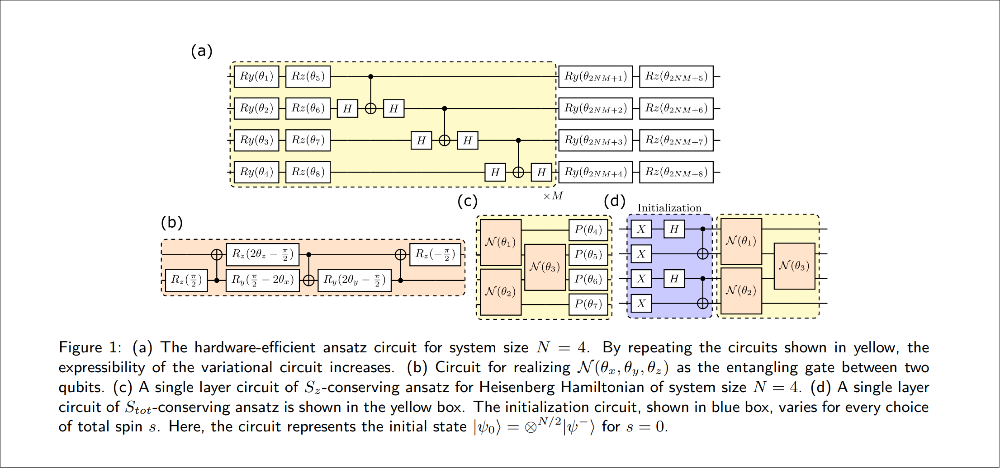

# Symmetry Enhanced Variational Quantum Spin Eigensolver

This repository is developed for the **Classiq Mega Challenge**, where the goal is to reproduce the results of a quantum eigensolver paper on a four-qubit system. The challenge requires using both $S_z$-conserving and hardware-efficient ansatzes with depths between 5 and 15 layers. The target outcomes include accurately estimating the ground state energy and analyzing the algorithm's behavior as the initial parameters vary.

## Challenge Description

In this challenge, the objective is to replicate the paper’s results for $N=4$ qubits. The tasks include:
1. Applying both the $S_z$-conserving and hardware-efficient ansatzes with circuit layers ranging from 5 to 15.
2. Obtaining accurate estimates of the system's ground state energy.
3. Conducting a comprehensive analysis of the algorithm’s sensitivity and convergence behavior when varying the initial parameters.

## Overview

Variational quantum algorithms offer a pathway to exploit near-term quantum devices. However, resource demands grow significantly for excited state simulations. This implementation provides a symmetry-enhanced VQE, addressing these challenges by:
1. **Hardware Symmetry-Preserving Design**: Embedding symmetries directly in the circuit, yielding states with specific quantum numbers.
2. **Hybrid Symmetry-Preserving Design**: Distributing symmetry constraints between circuit design and the cost function, balancing efficiency with simplicity.

### Key Concepts

The VQE algorithm in this implementation is adapted to leverage symmetry in two ways:
- **Hardware Symmetry-Preserving**: Embeds symmetry requirements directly into the circuit design to produce states with the desired quantum characteristics.
- **Hybrid Symmetry-Preserving**: Symmetry constraints are shared between the circuit and the cost function, allowing for simplified circuit design without fully sacrificing symmetry properties.

## Mathematical Foundations

### Variational Quantum Eigensolver (VQE) Framework

VQE employs a parameterized quantum circuit to prepare a quantum state $|\psi(\theta)\rangle$, with $\theta$ as tunable parameters. The algorithm minimizes the Hamiltonian expectation $\langle H \rangle = \langle \psi(\theta) | H | \psi(\theta) \rangle$ to find the system’s ground state, optimizing $\theta$ iteratively using the L-BFGS method. The classical resources are quantified through the parameter count $L$ and iteration count $n_I$.

### Symmetry-Enhanced Extensions

To manage the high-resource demand of VQE for excited states, we introduce symmetry:
- **Circuit Symmetry Embedding**: Embedding symmetry directly reduces the need for deeper circuits.
- **Cost Function Penalization**: Adding symmetry-related penalty terms to the cost function encourages the desired eigenstates.

For excited states, the cost function is modified as:
$\text{Cost} = \langle H \rangle + \beta \sum_{i} \langle S^2_{\text{tot}} - s(s+1) \rangle^2$
where $\beta$ is a penalty factor, ensuring states adhere to specific symmetry constraints.

## Implementation Details

This codebase supports:
1. **Hardware Symmetry-Preserving Circuit**: This ansatz conserves $S_z$ and $S_{\text{tot}}$, using parameterized rotations and entangling gates.
2. **Hybrid Symmetry Preservation**: Circuits conserving only $S_z$ while using cost-function penalties for $S_{\text{tot}}$, balancing simplicity and performance.

## Resource Analysis and Efficiency

Resource demands are evaluated in terms of:
- **Quantum Resources**: CNOT gate count for target fidelity.
- **Classical Resources**: Product $CR = L \times n_I$, representing parameter count $L$ and iteration count $n_I$.

The results show a significant reduction in classical resources, with the hybrid $S_z$-conserving circuit achieving 80% less classical resource usage compared to standard VQE.

## Conclusion

This repository provides a scalable approach for simulating low-energy states on near-term quantum devices by leveraging symmetry-preserving VQE techniques. This challenge-driven implementation is well-suited for quantum chemistry and material science applications, offering a streamlined path to accurate quantum simulations.